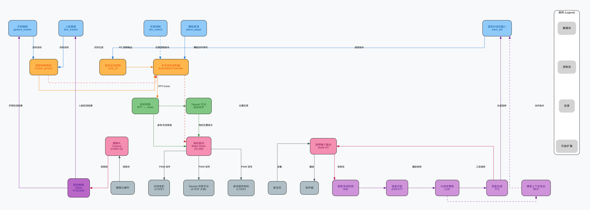
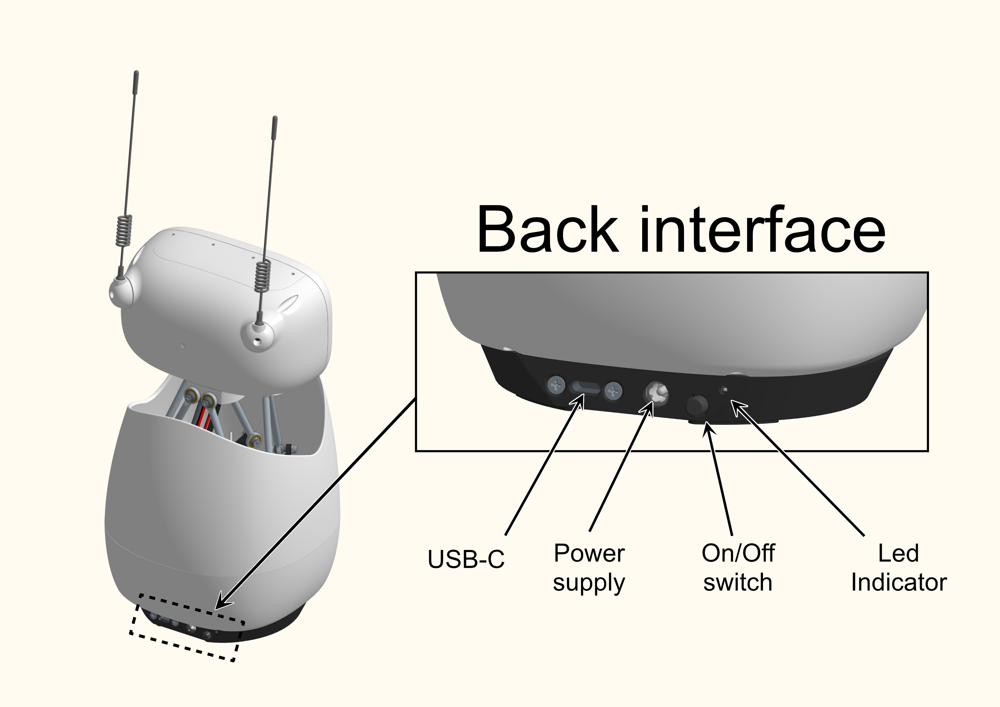
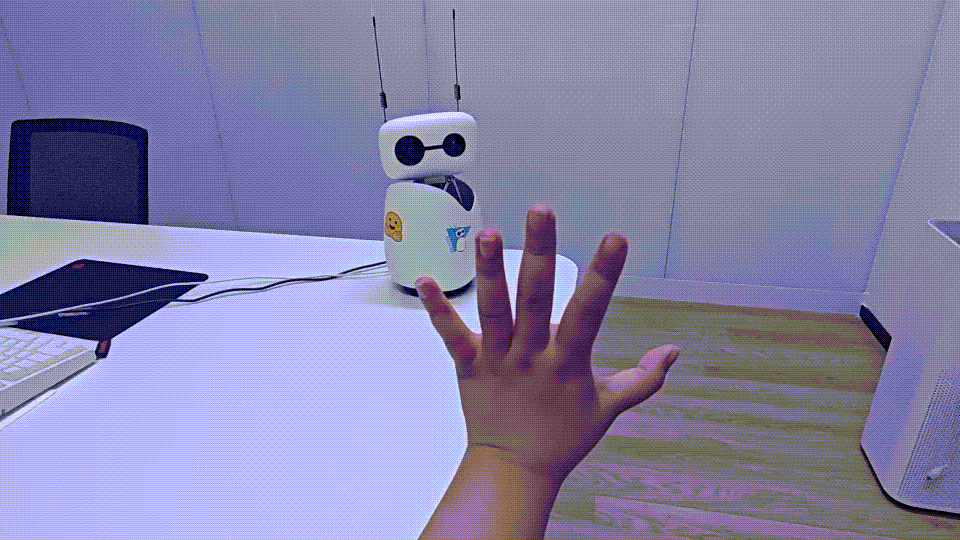
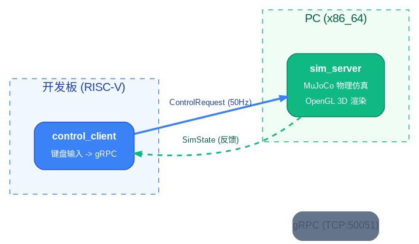
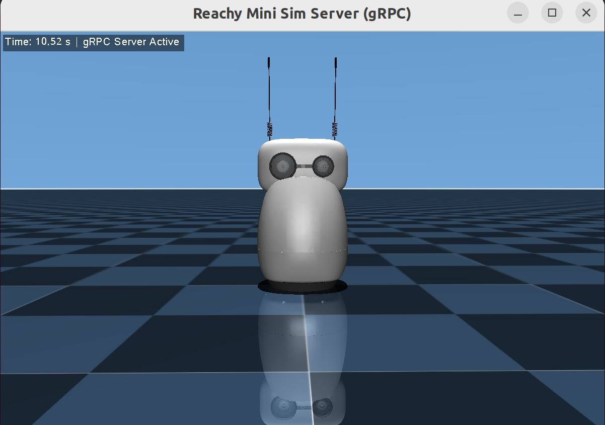

# Reachy Mini 桌面机器人

Reachy Mini 是由 Hugging Face 与 Pollen Robotics 联合推出的开源桌面机器人，本方案基于 进迭时空（SpacemiT） K3-COM260 计算平台进行适配与开发。
## 1. 方案概述

Reachy Mini 是一个小型机器人运动控制交互应用，支持以下功能：

- **视觉跟随**：通过摄像头实时检测人脸/手势，经 PD 控制算法驱动 Stewart 并联平台电机
- **语音对话控制**：集成 VAD + ASR + LLM + TTS 全链路语音交互，支持语音指令控制机器人动作
- **舞蹈表演**：预编排的舞蹈动作序列，支持音频同步播放
- **仿真控制**：通过 gRPC 远程控制 PC 端 MuJoCo 仿真，支持键盘实时操控和预设动作



**核心组件**：
- 头部：6 DOF 运动（x, y, z, roll, pitch, yaw）
- 身体：垂直轴旋转
- 天线：2 个电机，360 度旋转

## 2. 硬件清单

| 项目 | 内容 |
| --- | --- |
| 推荐硬件 | Reachy Mini 机器人（Lite 版本） |
| 关键外设 | Sony IMX708 摄像头、PDM MEMS数字麦克风、扬声器、XL330 舵机 |
| 计算平台 | k3-com260  |

------------------------------------------
 


## 3. 环境搭建

### 3.1 硬件连接

1. 连接电源
2. 连接开发板 USB 口




通过拔插 USB 确定串口号
```
 # 电机串口默认为 /dev/ttyACM0
   ls /dev/tty*
```

### 3.2 代码下载
 ```
   repo init -u https://github.com/spacemit-robotics/manifest.git -b main -m default.xml \
  --repo-url=https://gitee.com/spacemit-robotics/git-repo \
  -g core,peripherals,agent_tools,model_zoo,multimedia,reachy_mini
repo sync -j4
repo start robot-dev --all
```

### 3.2 外部依赖

**核心依赖**：
- `components/peripherals/motor` — 电机驱动库
- `components/model_zoo/vision` — 视觉推理库
- OpenCV（`/opt/opencv-spacemit`）— 图像采集与显示

**音频依赖**（`test_dance` 和 `reachy_voice_bot` 需要）：
- `libportaudio` — 音频采集/播放
- `libsndfile` — 音频文件读写
- `libsamplerate` — 采样率转换
- `libfftw3` — FFT 运算

**AI 组件依赖**（仅 `reachy_voice_bot`）：
- `components/model_zoo/asr` — 语音识别
- `components/model_zoo/tts` — 语音合成
- `components/model_zoo/vad` — 语音活动检测
- `components/model_zoo/llm` — 大语言模型推理     
- `components/multimedia/audio` — 音频处理库   # **优先编译此模块** 
- `mcp`

**_所有依赖在编译时会被下载_**

### 3.3 编译构建
```
cd spacemit_robot    # 跳转下载 SDK 的目录，即项目根目录

lunch  # 选择方案
```
方案如下
```
You're building on Linux

Lunch menu... pick a combo:

     1  k1-muse-pipro-minimal
     2  k3-com260-mars
     3  k3-com260-minimal
     4  k3-com260-reach-mini
     5  k3-com260-humanoid-asimov
     6  k3-com260-humanoid-g1
     7  k3-com260-humanoid-go1
     8  k3-com260-humanoid-h1_2
     9  k3-com260-humanoid-qinglong
     10 k3-com260-humanoid-r1
     11 k3-com260-humanoid-tiangong
     12 k3-com260-humanoid-tinker
     13 kx-generic-omni_agent

```
选择 k3-com260-reach-mini

```
m  #执行编译
```
**_所有依赖将在执行编译时检测和下载，系统依赖选择 y 自动安装_**


**首次编译说明**：
- 可执行文件安装到 `output/staging/bin`
- 所有依赖库和头文件安装在 `output/staging/lib` 和 `output/staging/include`


## 4. 综合场景：语音控制全功能交互（推荐）

`reachy_voice_bot` 是 Reachy Mini 的核心应用，将语音对话、动作控制、视觉跟随、舞蹈表演统一在一个语音入口中，用户无需切换程序即可完成所有交互。

### 4.1 前置准备
完成 [3.3编译](#33-编译构建)

### 4.2 启动方式
#### 1. 启动
程序支持不带任何命令行参数启动（推荐），所有参数均可通过配置文件 `config/config_paras.yaml` 预设，未配置的设备参数将自动探测。

**推荐：守护进程模式启动（最简单）**

只需确保配置文件中 `llm.url` 已正确填写，即可一键启动：

```bash
reachy_voice_bot start    # 后台启动
```
预期现象： (初始化成功后) 语音播报开始对话提示，开始进行语音控制

##### 语音控制与模式切换关键词

启动后可通过语音指令控制机器人，系统会优先匹配以下关键词，未命中时回退到 LLM 自由对话：

| 目的 | 关键词/示例 | 说明 |
|------|------------|------|
| 启动人脸跟随 | "跟着我"、"跟随我"、"看着我"、"人脸跟踪" | 启动人脸检测并进入人脸跟随模式 |
| 启动手势跟随 | "跟着手掌"、"手势跟随"、"手势跟踪"、"跟着手" | 启动手势检测并进入手势跟随模式 |
| 停止跟随 | "别跟了"、"停止跟随"、"不要跟了"、"停止手势" | 停止当前跟随模式，释放 NPU 资源 |
| 头部动作 | "左转"、"右转"、"抬头"、"低头"、"左歪头"、"右歪头" | 控制头部单轴运动（Yaw/Pitch/Roll） |
| 身体动作 | "身体左转"、"身体右转" | 控制身体垂直轴旋转 |
| 复位 | "回正"、"回中"、"复位" | 全身回中归零 |
| 舞蹈表演 | "甩头舞"、"杰克逊"、"小鸡啄米"、"嗯哼歪头" | 执行预编排舞蹈（含音频同步） |
| 系统退出/关机 | "睡觉吧"、"关机" | 退出程序 |


#### 2. 状态查询
```
reachy_voice_bot status   # 查看运行状态和当前模式
```
预期现象： 输出当前模式

模式列表
| 状态值 | 说明 |
|--------|------|
| `初始化中` | 程序正在启动，正在初始化 LLM、VAD、TTS、音频设备等 |
| `对话模式` | 所有引擎与音频初始化完成，等待语音输入（正常就绪） |
| `人脸跟随` | 当前处于人脸跟随模式（NPU 占用，限制其他动作） |
| `手势跟踪` | 当前处于手势跟踪模式（NPU 占用） |
| `未知` / 无文件 | 未运行或状态不可用 |


#### 3. 终止程序
```
reachy_voice_bot stop     # 停止
```
预期现象： 机器人卸力，程序结束


####  参数配置说明与拓展

程序支持两种配置方式，必配项为 **串口设备节点**（`motor.port`）和 **LLM 地址**（`llm.url`），其余参数不配置时自动探测。

**关于 llm model 的说明**

配置文件默认提供 5 种本地模型选择，通过配置文件、命令行方式传入均可，不传则使用默认配置（`qwen2.5:0.5b`）

本地模型列表提供的模型支持启动自动下载，如果使用其他本地模型，请下载到路径： **`~/.cache/models/llm/`**，指定即可生效

模型列表：

| 配置名称 | 模型文件 | 说明 |
|----------|----------|------|
| `qwen2.5:0.5b` | `qwen2.5-0.5b-instruct-q4_0.gguf` | 默认模型，内存占用最小 |
| `qwen2.5:1.5b` | `qwen2.5-1.5b-instruct-q4_0.gguf` | 平衡性能与资源 |
| `qwen2.5:3b` | `qwen2.5-3b-instruct-q4_0.gguf` | 更强的对话能力 |
| `glm-edge:1.5b` | `glm-edge-1.5b-chat-q4_0.gguf` | GLM 系列轻量模型 |


**方式一：配置文件（推荐）**

编辑 `config/config_paras.yaml`（位于 `reachy_mini/config` 目录，或通过 `--config <path>` 指定）：

```yaml
llm:
  url: "http://localhost:8080"    # 必配：LLM API 地址
  model: "qwen2.5:0.5b"
motor:
  port: "/dev/ttyACM0"           # 必配：电机串口节点
tts:
  engine: "matcha:zh-en"
# 其余参数（audio、camera 等）留默认值即可，程序自动探测
```

**方式二：命令行参数**

```bash
reachy_voice_bot --llm-url http://localhost:8080 --motor-port /dev/ttyACM0
```

**使用云端大模型时**，将 `llm.url` 改为云端地址或通过命令行覆盖：

```bash
export OPENAI_API_KEY="sk-your-api-key"
reachy_voice_bot --llm-url https://api.deepseek.com/v1 --model deepseek-chat
```

> `--llm-url` 填写到 `/v1` 即可，程序自动拼接 `/chat/completions`

**参数优先级**：`命令行参数 > 配置文件 > 自动探测`

### 4.2.1 运行模式与命令行参数

**运行模式**：

| 模式 | 命令 | 说明 |
|------|------|------|
| 后台守护（推荐） | `reachy_voice_bot start [参数...]` | 日志写入 `/tmp/reachy_voice_bot.log` |
| 前台运行 | `reachy_voice_bot [参数...]` | 适合调试，日志输出到控制台 |
| 停止 | `reachy_voice_bot stop` | 发送 SIGTERM 并清理状态文件 |
| 状态查询 | `reachy_voice_bot status` | 显示 PID 和当前模式 |

**命令行参数**（均可通过配置文件替代）：

| 参数 | 说明 | 默认值 |
|------|------|--------|
| `--llm-url <url>` | LLM API 地址 | 配置文件 `llm.url` |
| `--model <name>` | LLM 模型名称 | `qwen2.5:0.5b` |
| `--tts <engine>` | TTS 后端 | `matcha:zh-en` |
| `--config <path>` | 指定配置文件路径 | 内置默认路径 |
| `--motor-port <port>` | 电机串口路径 | `/dev/ttyACM0` |
| `--camera-id <id>` | 人脸跟踪相机 ID | 自动探测 |
| `-i, --input-device <id>` | 麦克风设备索引 | 自动探测 |
| `-o, --output-device <id>` | 扬声器设备索引 | 自动探测 |
| `--capture-rate <hz>` | 录音采样率 | 自动探测 |
| `--capture-channels <n>` | 录音声道数 | 自动探测 |
| `--playback-rate <hz>` | 播放采样率 | 自动探测 |
| `--playback-channels <n>` | 播放声道数 | 自动探测 |
| `--mcp-config <path>` | MCP 配置文件（启用工具调用） | — |
| `--save-audio [file]` | 保存录音用于调试 | — |
| `--list-devices` | 列出可用音频设备 | — |

### 4.3 交互逻辑

1. **关键词优先**：语音识别结果首先匹配预定义关键词表，命中后直接执行对应动作（绕过 LLM），响应更快
2. **LLM 兜底**：未命中关键词的自然语言输入交由 LLM 处理，支持自由对话和 MCP 工具调用
3. **NPU 互斥保护**：人脸/手势跟随运行期间 NPU 被占用，系统自动拦截除"停止跟随"外的所有指令，避免资源冲突
4. **语音关机**：说"睡觉吧"或"关机"，机器人回复"好的，再见，下次再聊"后自动终止进程

### 4.4 典型使用流程

```
用户: "看着我"
机器人: "好的，即将启动跟随"  → 启动人脸跟随

用户: "左转"
机器人: (无响应，NPU 围栏拦截)  → 跟随期间不响应其他动作

用户: "别跟了"
机器人: "好的，停止跟随"  → 停止跟随，释放 NPU

用户: "甩头舞"
机器人: "好的，甩头舞"  → 播放舞蹈音乐 + 执行编排动作

用户: "跟着手掌"
机器人: "好的，即将启动跟随"  → 启动手势跟随

用户: "停止手势"
机器人: "好的，停止跟随"  → 停止手势跟随

用户: "今天天气怎么样？"
机器人: (LLM 回答)  → 未命中关键词，走 LLM 对话

用户: "睡觉吧"
机器人: "好的，再见，下次再聊"  → 程序退出
```

### 4.5 运行效果

- 完整语音交互链路：录音 → VAD 检测 → ASR 识别 → LLM 对话 → TTS 合成 → 播放
- 自动探测 Reachy Mini USB 设备（声卡、摄像头），自动配置音频参数和音量
- 支持语音指令控制机器人动作（点头、摇头、舞蹈等）
- 支持语音启动/停止人脸跟随和手势跟随
- 实时音频处理和响应

<div align="center">
  <video src="https://cdn-resource.spacemit.com/file/product/K3/assets/reachy-mini_voice_ctl.mp4" 
         controls
         playsinline 
         style="max-width: 100%; border-radius: 8px;">
    您的浏览器不支持 HTML5 视频播放。
  </video>
</div>


## 5. 独立场景：人脸/手势跟随

人脸跟随和手势跟随也可作为独立程序运行（不依赖语音系统）。

### 5.1 确认摄像头 ID

```bash
v4l2-ctl --list-devices
# 示例输出:
# Reachy Mini Camera: Reachy Mini (usb-xhci-hcd.1.auto-1.4.4):
#   /dev/video13
```

### 5.2 启动

```bash
# 人脸跟随
face_tracker yolov5-face.yaml --control --camera-id 13 --port /dev/ttyACM0

# 手势跟随（当前支持手掌）
gesture_tracker yolov5_gesture.yaml --control --camera-id 13 --port /dev/ttyACM0
```

**通用选项**：`--camera-id <id>`、`--port <path>`、`--no-gui`（无显示屏时）、`--control`（启用电机）、`--model-path <path>`

<div style="width: 100%; display: flex; justify-content: center;">
  
</div>


### 辅助指令
```bash
# 音量调节（程序启动时已自动设置 PCM,0=100% PCM,1=80%，如需手动调整）
aplay -l                          # 获取 card id
amixer -c 0 sset 'PCM',0 100%    # 音量
amixer -c 0 sset 'PCM',1 80%     # 增益
```


## 6. 常见问题

| 现象 | 处理 |
| --- | --- |
| 找不到模型文件 | 检查所有依赖组件是否已经编译，mm 触发时会自动安装模型库 |
| 摄像头无法打开 | 检查 `/dev/video*` 设备是否存在，尝试 `--camera-id 1` 或其他 ID |
| 电机无响应 | 确认串口连接正确，检查 `/dev/ttyACM0` 权限：`sudo chmod 666 /dev/ttyACM0`；执行 `test_api /dev/ttyACM0` 验证电机驱动 |
| 无显示屏时运行跟随程序 | 添加 `--no-gui` 参数禁用 GUI 窗口 |
| 语音识别不工作 | 检查麦克风设备 ID，使用 `--list-devices` 列出可用设备 |
| 机器人不响应指令 | 执行 `test_api /dev/ttyACM0` 验证电机驱动；执行 `test_dance /dev/ttyACM0` 验证舞蹈动作 |

## 7. 仿真控制

通过 gRPC 双向流式通信远程控制 PC 端的 MuJoCo 仿真服务端（`sim_server`），实现远程遥控仿真机器人。


### 代码获取


**注：仿真服务端在 pc 上运行，当前支持 linux 系统**

[代码仓库](https://gitlab.dc.com:8443/robotics/simulation)
```
git clone https://gitlab.dc.com:8443/robotics/simulation.git
```
下载资源文件
```
cd simulation
wget -r -np -nH --cut-dirs=2 -R index.html https://archive.spacemit.com/ros2/simulation_reachy_mini/assets/
```
**仿真服务端** 代码仅内部开放，持续更新中

### 7.1 架构




### 7.2 编译
客户控制端：

如果已经通过 mm/m 编译，则不用再执行本步骤
```bash
# 编译（作为主项目子模块自动编译，或单独编译）
cd simulation
mkdir -p build && cd build
cmake .. && make -j$(nproc)

```
仿真服务端见[代码仓库](https://gitlab.dc.com:8443/robotics/simulation)文档说明

### 7.3 网络配置

WiFi 延迟抖动较大，建议使用网线直连 PC 和开发板：

```bash
# PC 端配置静态 IP
sudo ip addr add 192.168.88.1/24 dev eth0
sudo ip link set eth0 up

# 开发板端配置静态 IP
sudo ip addr add 192.168.88.100/24 dev eth0
sudo ip link set eth0 up

# 验证连通性
ping 192.168.88.1
```


### 7.4 运行

```bash
# PC 端启动仿真服务
./sim_server 0.0.0.0:50051

# 开发板端启动客户端（默认连接 192.168.88.100:50051）
./control_client

# 指定服务端地址
./control_client 192.168.88.1:50051
```
服务端


### 7.5 键盘控制

| 按键 | 功能 | 说明 |
|------|------|------|
| `W/S` | Pitch 上/下 | [-35°, +35°]，步进 5° |
| `A/D` | Yaw 左/右 | [-170°, +170°]，步进 5° |
| `Q/E` | Roll 左/右倾 | [-25°, +25°]，步进 5° |
| `Z/X` | 左天线 减/增 | 步进 0.1 rad |
| `C/V` | 右天线 减/增 | 步进 0.1 rad |
| `1` | 点头动作 | 重复 3 次 |
| `2` | 摇头动作 | 重复 3 次 |
| `3` | 天线舞蹈 | 重复 3 次 |
| `H` | 回到原点 | 所有轴归零 |
| `ESC` | 退出程序 | — |


## 8. 技术参考

### 8.1 构建目标

| 可执行文件 | 说明 | 依赖 |
|---|---|---|
| `face_tracker` | 人脸跟随 | motor, vision, OpenCV |
| `gesture_tracker` | 手势跟随 | motor, vision, OpenCV |
| `reachy_voice_bot` | 语音对话控制 | motor, vision, OpenCV,  AI 组件库 |
| `control_client` | 仿真控制客户端 | gRPC, protobuf |
| `test_api` | 运动 API 测试（排查用） | motor |
| `test_dance` | 舞蹈动作测试（排查用） | motor, portaudio, sndfile, samplerate |

### 8.2 目录结构

```
reachy_mini
├── CMakeLists.txt
├── config
│   ├── config_paras.yaml
│   ├── download_face_gesture_models.sh
│   ├── yolov5-face.yaml
│   └── yolov5_gesture.yaml
├── LICENSE
├── package.xml
├── simulation
│   ├── CMakeLists.txt
│   ├── control_client.cc
│   └── reachy_sim.proto
└── src
    ├── face_tracker.c
    ├── gesture_tracker.c
    ├── kinematics
    ├── media
    ├── motor_ctl
    ├── talent_show
    ├── tracker_generic
    ├── vision
    ├── voice
    └── voice_bot.cpp
```

## 9. 许可证

Apache-2.0
